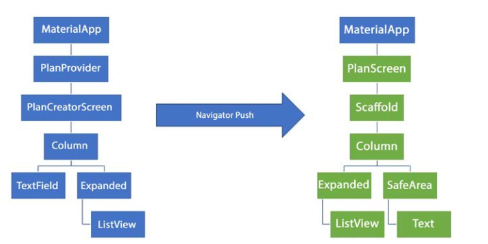
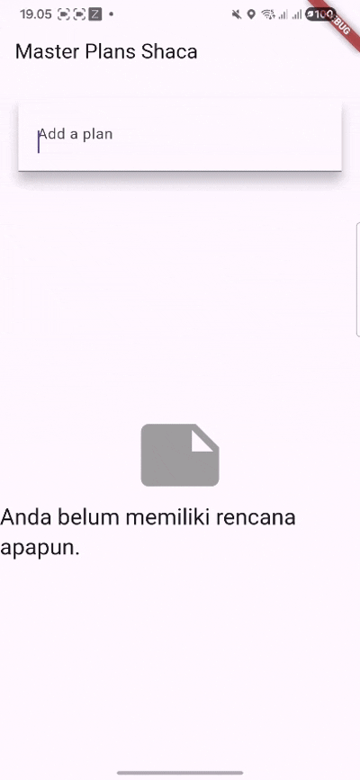

# Tugas Praktikum 2: InheritedWidget
## 1. Selesaikan langkah-langkah praktikum tersebut, lalu dokumentasikan berupa GIF hasil akhir praktikum beserta penjelasannya di file README.md! Jika Anda menemukan ada yang error atau tidak berjalan dengan baik, silakan diperbaiki sesuai dengan tujuan aplikasi tersebut dibuat.

## 2. Jelaskan mana yang dimaksud InheritedWidget pada langkah 1 tersebut! Mengapa yang digunakan InheritedNotifier?

Secara teknis, PlanProvider adalah turunan dari InheritedNotifier, yang pada dasarnya adalah InheritedWidget yang lebih cerdas. InheritedNotifier digunakan karena secara otomatis akan memicu rebuild (pembangunan ulang widget) pada semua widget yang bergantung padanya (dependOnInheritedWidgetOfExactType) setiap kali objek ValueNotifier<Plan> di dalamnya berubah (planNotifier.value = PlanBaru). Ini mengotomatisasi manajemen state reaktif tanpa perlu override updateShouldNotify.

## 3. Jelaskan maksud dari method di langkah 3 pada praktikum tersebut! Mengapa dilakukan demikian?

Method completedCount dan completenessMessage ditambahkan ke dalam Model (Plan) untuk memindahkan logika bisnis (menghitung progres) keluar dari View (PlanScreen). completedCount untuk menghitung jumlah tugas yang memiliki properti complete: true. Dan, completenessMessage memformat hasil hitungan tersebut menjadi string yang siap ditampilkan.

Ini dilakukan untuk menegakkan prinsip pemisahan tanggung jawab (separation of concerns). Model (Plan) bertanggung jawab atas datanya dan cara memprosesnya; View (PlanScreen) hanya bertanggung jawab untuk menampilkan data yang sudah jadi.

## 4. Lakukan capture hasil dari Langkah 9 berupa GIF, kemudian jelaskan apa yang telah Anda buat!

# Tugas Praktikum 3: State di Multiple Screens

## 1. Selesaikan langkah-langkah praktikum tersebut, lalu dokumentasikan berupa GIF hasil akhir praktikum beserta penjelasannya di file README.md! Jika Anda menemukan ada yang error atau tidak berjalan dengan baik, silakan diperbaiki sesuai dengan tujuan aplikasi tersebut dibuat.

## 2. Berdasarkan Praktikum 3 yang telah Anda lakukan, jelaskan maksud dari gambar diagram berikut ini!

**a. PlanCreatorScreen (Master View)**
Ini adalah tampilan awal untuk membuat dan memilih Plan.

* Tujuan: Mengelola daftar global List<Plan>.

* Struktur: PlanProvider berada di level tertinggi, menyediakan data global ke PlanCreatorScreen. Screen ini berisi TextField untuk menambah Plan baru (Langkah 12) dan ListView untuk menampilkan semua Plan yang telah dibuat (Langkah 14).

**b. Kanan: PlanScreen (Detail View)**
Ini adalah tampilan yang muncul setelah memilih salah satu Plan dari Master View.

* Tujuan: Menampilkan dan mengelola Task dari satu Plan yang dipilih.

* Navigasi: Diakses melalui Navigator.push dari PlanCreatorScreen, meneruskan objek Plan yang dipilih melalui constructor (PlanScreen(plan: plan)).

* Struktur: PlanScreen menggunakan Expanded > ListView untuk menampilkan daftar Task dan SafeArea > Text untuk menampilkan pesan progres (completenessMessage). Screen ini mengakses PlanProvider bukan untuk mendapatkan list secara umum, tetapi untuk mencari dan memperbarui Plan spesifik yang sedang ditampilkan di dalam list global tersebut.

## 3. Lakukan capture hasil dari Langkah 14 berupa GIF, kemudian jelaskan apa yang telah Anda buat!

