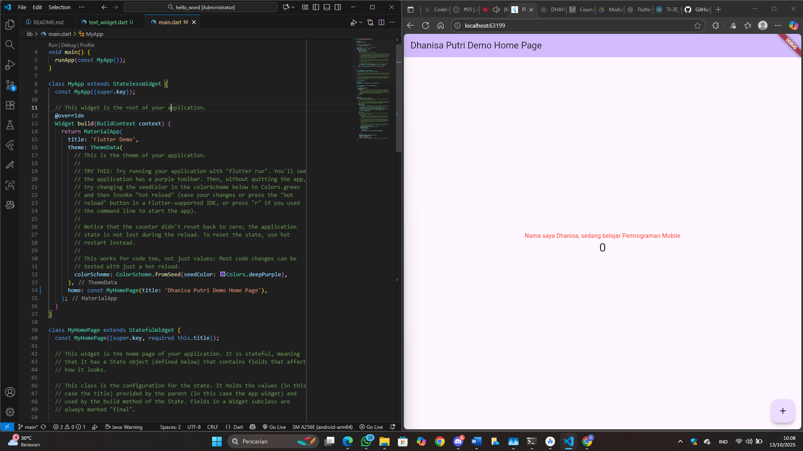
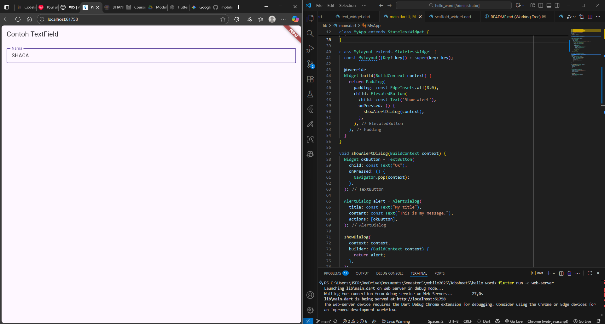

# hello_word

A new Flutter project.

Nama : Dhanisa Putri Mashilfa
NIM : 2341720212

# Praktikum 4: Menerapkan Widget Dasar

## Langkah 1: Text Widget

## Langkah 2: Image Widget

#  Praktikum 5: Menerapkan Widget Material Design dan iOS Cupertino

## Langkah 1: Cupertino Button dan Loading Bar

## Langkah 2: Floating Action Button (FAB)

## Langkah 3: Scaffold Widget

## Langkah 4: Dialog Widget

## Langkah 5: Input dan Selection Widget

## Langkah 6: Date and Time Pickers

