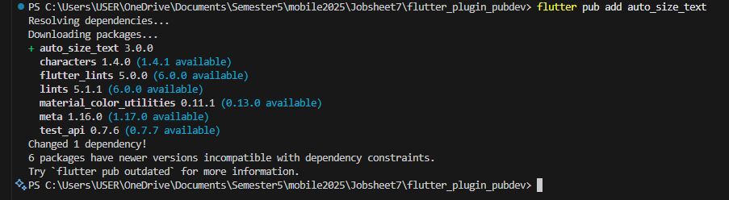
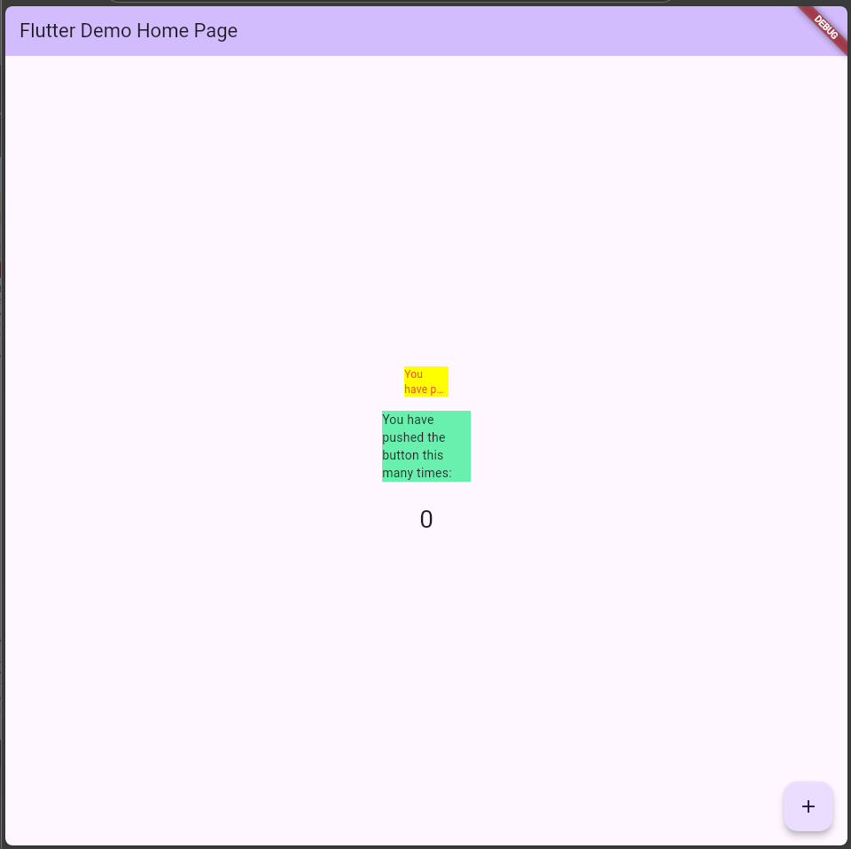

# Langkah 1: Buat Project Baru
# Langkah 2: Menambahkan Plugin

# Langkah 3: Buat file red_text_widget.dart
# Langkah 4: Tambah Widget AutoSizeText
# Langkah 5: Buat Variabel text dan parameter di constructor
# Langkah 6: Tambahkan widget di main.dart

# Tugas Praktikum 1

1. Selesaikan Praktikum tersebut, lalu dokumentasikan dan push ke repository Anda berupa screenshot hasil pekerjaan beserta penjelasannya di file README.md!

2. Jelaskan maksud dari langkah 2 pada praktikum tersebut!
Langkah 2 berfungsi untuk menambahkan plugin eksternal dari pub.dev ke dalam project Flutter, yaitu auto_size_text.
Plugin ini digunakan agar ukuran teks menyesuaikan secara otomatis dengan ruang yang tersedia di layar (container), sehingga teks tidak terpotong dan tetap proporsional.

3. Jelaskan maksud dari langkah 5 pada praktikum tersebut!
Langkah 5 bertujuan untuk menambahkan variabel dan constructor pada widget RedTextWidget, agar bisa menerima data teks dari luar class.

4. Pada langkah 6 terdapat dua widget yang ditambahkan, jelaskan fungsi dan perbedaannya!

| | Widget | Fungsi | Perbedaan |
| :--- | :--- | :--- | :--- |
| 1 | `RedTextWidget` | Menampilkan teks berwarna merah yang secara otomatis menyesuaikan ukuran huruf agar tidak terpotong. | Menggunakan plugin `auto_size_text` yang dapat mengatur ukuran font dinamis. |
| 2 | `Text` | Menampilkan teks biasa tanpa penyesuaian ukuran otomatis. | Widget bawaan Flutter tanpa fitur penyesuaian otomatis — teks bisa meluber jika wadahnya sempit. |

---

5. Jelaskan maksud dari tiap parameter yang ada di dalam plugin `auto_size_text` berdasarkan tautan di dokumentasi ini!

| | Parameter | Tipe | Fungsi |
| :--- | :--- | :--- | :--- |
| 1 | `text` | `String` | Isi teks yang akan ditampilkan. |
| 2 | `style` | `TextStyle` | Menentukan warna, ukuran, dan gaya huruf. |
| 3 | `maxLines` | `int` | Menentukan jumlah baris maksimal teks. |
| 4 | `overflow` | `TextOverflow` | Menentukan perilaku teks saat tidak muat, misalnya ellipsis (`...`). |
| 5 | `minFontSize` | `double` | Ukuran huruf minimum agar tetap terbaca. |
| 6 | `maxFontSize` | `double` | Ukuran huruf maksimum (default mengikuti `TextStyle.fontSize`). |
| 7 | `stepGranularity` | `double` | Langkah penyesuaian ukuran font saat menyesuaikan ruang. |
| 8 | `presetFontSizes` | `List<double>` | Daftar ukuran font yang diizinkan. |
| 9 | `wrapWords` | `bool` | Jika `false`, kata panjang tidak akan dipindah ke baris berikutnya. |

---

6. Kumpulkan laporan praktikum Anda berupa link repository GitHub kepada dosen!

6. Kumpulkan laporan praktikum Anda berupa link repository GitHub kepada dosen!